# Contact

- Email: [info@nunomo.net](mailto:info@nunomo.net)
- Github: Open an issue if you have a GitHub account. It's the best place to submit bugs.
- [Discord](https://discord.gg/kcvVTPkZVQ): Visit Nunomo's Discord server to chat about Qun, read announcements, and talk about events.
- Social media links:
  - Instagram: [@nunomo1](https://www.instagram.com/nunomo1)
  - Twitter (Japanese): [@nunomo1](https://twitter.com/nunomo1)
  - SoundCloud: [nunomo](https://soundcloud.com/user-425164341)
  - YouTube: [nunomollc](https://youtube.com/@nunomollc)


# QUN mk2

*Qun mk2* is a small synthesizer with a powerful sound engine, sequencer, and looper.

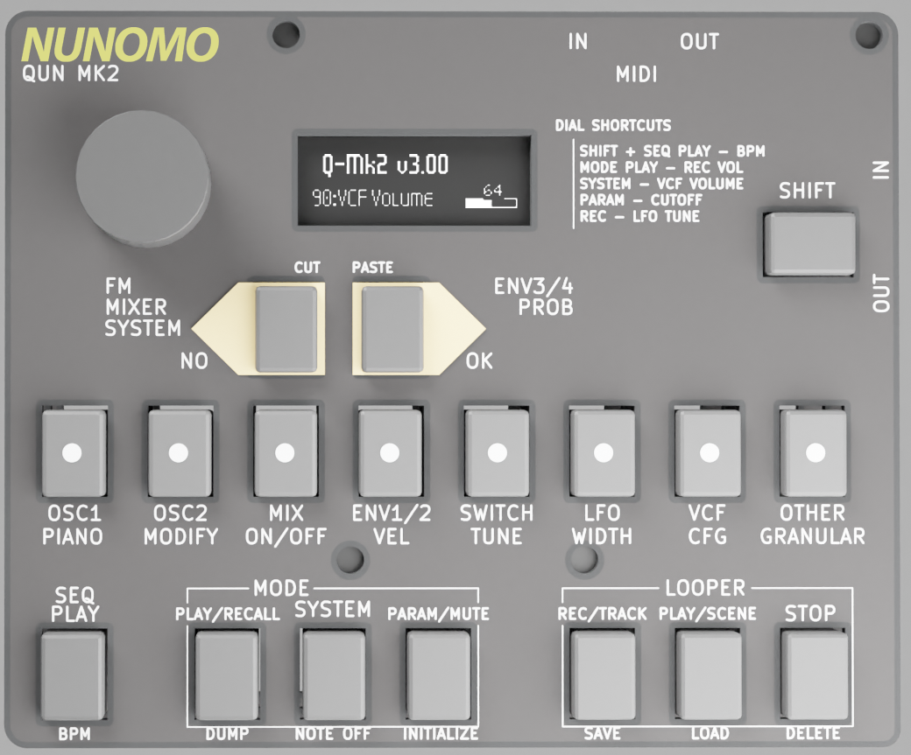

## Links and Information

* [Online Shop](https://shop.nunomo.net/products/): Purchase your own from our website.
* [Presets](https://github.com/raspy135/Qun-mk2/blob/main/sd_template.zip): Download and install tone presets  (see [Load Preset](#load-preset)). We constantly update the tone presets.
* [Issues](https://github.com/raspy135/Qun-synthesizer/issues): Report issues when you have problems or questions.
* [Firmware](./firmware): Firmware updates and instructions (see README.md).
* [CheatSheet](./cheatsheet.pdf): A printable cheat sheet listing buttons, device modes and sub-modes, shortcuts, and synth instrument parameters.
* Discord

**We are looking for your feedback! For general impressions and feedback, please email them to [info@nunomo.net](mailto:info@nunomo.net) or join Nunomo's [Discord server](https://discord.gg/kcvVTPkZVQ)!**


## Overview of the QUN mk2

_An explanatory [video segment](https://www.youtube.com/watch?v=7dNhxKBtwPo) is available._

Highlights:

Qun mk2 has a 2 oscillator virtual analog, FM, granular sound engine. The 2 oscillators can be used separately.

The sequencer is an 8-step based sequencer, and supports up to 32/64 steps per pattern. You can store 8 patterns for each preset bucket. And it has 8 buckets of tone preset + sequencer patterns. So you can quickly switch between 8 presets and 64 (8 x 8 pattern) patterns.

It has a 3 track looper with 5 scenes, so you can swap 3 tracks x 5 scenes while playing. 

More:

* **Analog Modeling Engine**
  * The analog modeling engine is **original and made from scratch**. It uses advanced algorithms for great organic sound. The engine is not a copy of a classic synth, it is designed to make modern sounds.
  * Low latency.
  * All analog modeling engine parameters can be configured through MIDI. 
  * Clean 2 Oscillators. Cheap synthesizers compromise this part sometimes, but QUN has no-alias noise Oscillators. All of the internal calculation is done by floating point for sound quality.
  * Oscillators can be used as 1 oscillator per voice, or 2 oscillators per voice.
  * Voice can be configured as 4 voices (Quad mode) or 2 voices (Dual mono).
  * The sound engine is compatible with Qun mk1 pocket synthesizer
  * Multiple QUN synths can be stacked to achieve a **Polyphonic** setup. 
  * Flexible MOD routing. 
  * 2 inputs can be used for **external audio signal**, or **external CV inputs**
  * 4 Envelope Generators
  * FM (4 Operators x 2)
  * **Granular / Sampler engine**
  * Vinyl record scratch mode
  * 1 LFO
  * 1 Organic sounding VCF
    * 2/4 Poles, Low-pass, Band-pass, High-pass, Notch
    * Key sync
  * 1 Effect -- Delay, Chorus, Flanger, BitCrusher
  * MIDI clock sync
* Player / Sequencer
  * Player -- piano mode
  * MIDI out to control external synths
  * **8/16 step sequencer has 4 pages, up to 64-step sequencer** will generate inspiring beats for you
    * Note On/Off/Double/Triple/4th
    * Modifiers (Transpose, shuffle, repeat steps and more)
    * Parallel pattern running up to 3 patterns
    * Scale quantize
    * Live recording
  * Looper
    * Sequencer synchronized, internal or externally clocked.
    * Looper can record the sound up to around 30 sec for each recording.
    * You can record the sound from the sound engine or external audio.
    * **3 tracks**, **20 Scenes**, total 60 recordings in one Session
    * Scene change while playing -- something like Ableton Live's session view
    * Cut / Paste
    * Play / Rec / Overdub
  * Mixer
  	* Looper tracks can be panned for stereo
  	* Integrated compressor -- Fixed parameters: 30ms attack, 100ms release, 1:3
  	* Stereo output
  	* Mute by track
* Micro SD card
  * Qun mk2 comes with a micro SD card.
  * All looper recordings, presets, and granular samples are stored to the SD card

## CONNECTIONS

* Power: Use a good quality USB power supply. Connect the USB cable to the `POWER` labeled USB port -- the top one, above `UART`.
* MIDI: Use **TRS A** MIDI adapters to connect MIDI cables. The TRS A type adapter is the same as KORG, AKAI, and Make Noise's adapter. This is the lowest latency option. The synth comes with a MIDI TRS A cable.
* Qun has microphones, a stereo line input, and a phone output.
  * `LINE IN` and `PHONE OUT` are located on the right side.
  * The level of PHONE OUT is not strong, so please connect a headphone amp or mixer.
  * The looper's mixer is stereo. **Please use a stereo cable for sound input and output**. 
* Qun comes with a micro SD card. Qun mk2 always needs an SD card. It is safe to remove the card when the disk access indicater is not lit (see the illustration under PLAY MODE). However, the SD is not hot swappable. Please reset the device when you remove the SD card. SDHC is supported, and the disk size is up to 32GB. SDXC is NOT supported. Class 10 card or higher is required to satisfy Qun's bandwidth needs. "Class 10" is indicated on SD cards as a circled 10 or "C10".

## MAJOR MODES

Qun mk2 has three major modes.

Mode | Description
------------ | -------------
Play | Playing from the sequencer and looper. 
System | Loading and saving data, and changing system settings.
Param | Parameter mode: Changing the synthesizer’s instrument parameters.

## BASIC OPERATION

Each major mode has selectable sub-modes. For example, the Param major mode has an `OSC1` sub-mode which configures Oscillator 1, and the Play major mode has a `PIANO` sub-mode which allow direct playing of notes using the [1-8] buttons.

* To switch sub-mode, press SHIFT + [1-8] button or NO/OK buttons to change sub-mode.
  * After you enter the sub-mode you want, press [1-8] button to select a parameter.
  * See the names printed on the device for sub-modes of Param and Play major modes. For example, look underneath the [1-8] buttons and see `OSC1` and `PIANO`.
  * Alternatively, you can select sub-mode by press SHIFT + turn the dial.
  * Alternatively, you can select sub-mode by Double-clicking MODE PLAY button or PARAM button then press [1-8] button.
* Press one of 8 buttons + rotate dial = Change parameter
* Rotate the dial = Change the current parameter.
* Long press the button to show the parameter full name and value.
* Double click the button to enter relative mode. The value adjustment will be relative.
* For initial training, referring to the [Qun cheatsheet](./cheatsheet.pdf) can be useful. Also seeing the parameter name when changing its value is useful for training: turn on Parameter Caption mode in System2 menu, button 3.
* If you want to do fine value adjustment, you can use NO/OK buttons to change the value by 1. To do this, keep pressing one of 8 buttons and press NO or OK button.

Button | Primary function
------------ | -------------
SHIFT | Shift + [1-8] button or NO/OK button to select sub-mode 
[1-8] button | Select a parameter in the current sub-mode. Also show information with LEDs (see under LED Indicators).
NO | Select previous sequencer pattern
OK | Select next sequencer pattern
Dial | change parameters
SEQ PLAY | Start / Stop sequencer
REC + SEQ PLAY | Start sequencer live recording
MODE PLAY | Select Play mode
SYSTEM | Select System mode
PARAM | Select Parameter mode
REC | Looper status page
REC + LOOPER PLAY | Start looper recording
LOOPER PLAY | Start looper playing
LOOPER STOP | Stop looper playing
RST button on the base board | Reset the device
4 touch buttons at the bottom board | This can be used as a touch slider. See [Touch Slider](#touch-slider) section for detail. 
SHIFT + NO + OK | Sleep (Shutdown) the device. It will turn off most of the power consuming components like the main CPU and the screen. Press the RST button to restart the device.

## BASIC SHORTCUTS

Button | Function
------------ | -------------
SHIFT + MODE PLAY | Dump current preset to MIDI OUT. This is useful to transfer the current preset to another Qun / Qun mk2 synthesizer.
SHIFT + SYSTEM | All notes off
SHIFT + PARAM | Initialize the preset. You can choose some templates: Blank, Sampler, EvenSlice, Scratch. Please see the [Initialize preset](#initialize-preset) section for detail. 
SHIFT + SEQ PLAY + turn dial | Set BPM. Tap tempo by pressing SEQ PLAY 4 or more times while you keep pressing SHIFT. 
MODE PLAY + turn dial | Record volume -- stay at -6.0dB or lower to avoid clipping.
MODE PLAY + SYSTEM + turn dial | looper master volume 
SYSTEM + turn dial | VCF volume
PARAM + turn dial | VCF cutoff
REC + turn dial | LFO tune
LOOPER PLAY + [1-5] | Select Scene
REC + [1-3, 7,8] | Select recording track. A,B,C are mono tracks. Press 7, 8 for stereo recording. 7=A(Left)+B(Right), 8 = B+C. When you do stereo recording, you may want to set pan to left and right for the selected stereo tracks. 
PARAM + [1-3] | Mute track
MODE PLAY + [1-8] | Recall preset bucket (see under [Preset Bucket](#preset-bucket))
SEQ PLAY + [1-8] | Select Sequencer pattern
SHIFT + LOOPER PLAY + turn dial | Load session when you are not in System mode or Granular mode. 
SHIFT + LOOPER PLAY + [1-3] button | Import WAV file from import folder to selected track
SYSTEM + [1-8] | Temporary piano mode

## LED Indicators

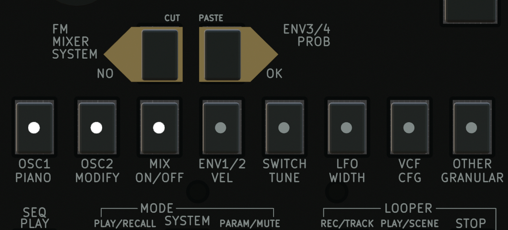

The synth has 8 LED indicators on the switch.
A solid, illuminated LED shows the current sequencer pattern number.

The LEDs may also show other information:

When | LED will show
------------ | -------------
When the sequencer is running | The current position of the sequencer
When trying to switch Scene, while pressing LOOPER PLAY | The current selected Scene
When trying to switch Track, while pressing LOOPER REC | The current selected Track
When trying to mute Trace, while pressing PARAM | The current mute status of the Tracks
When trying to switch Bucket, while pressing MODE PLAY | The current selected Bucket


## MIDI learning

Assigning proper MIDI CC to your MIDI keyboard is recommended for frequently used parameters, however, you can override MIDI CC temporarily by the following operation:

1. In Parameter mode, press and hold the corresponding parameter button for a long time -- about 3 sec. For example, OSC1's Pulse Width which is button 2 in OSC1 sub-mode.
2. Then the parameter name and value will be shown on the screen. Keep pressing the button another 3 sec.
3. Send MIDI CC signal from your MIDI keyboard: Turn a knob or move a fader. The sent MIDI CC# will control the assigned parameter.

Once the parameter is assigned, then "*" mark is indicated before the CC number. Original CC assignment is still working. It won't be affected with MIDI dumping.
MIDI learning will take any MIDI channel. For example, even if you set the device to receive MIDI channel 2, MIDI learning can receive CC# for channel 3, or any other channels.

To cancel the override, do the same operation again.

To avoid confusion, this setting won't be saved.

## Session

Qun automatically collects the current looper recordings, instrument and sequencer presets into a Session. Sessions can be saved and loaded. They are automatically numbered and can be manually named.

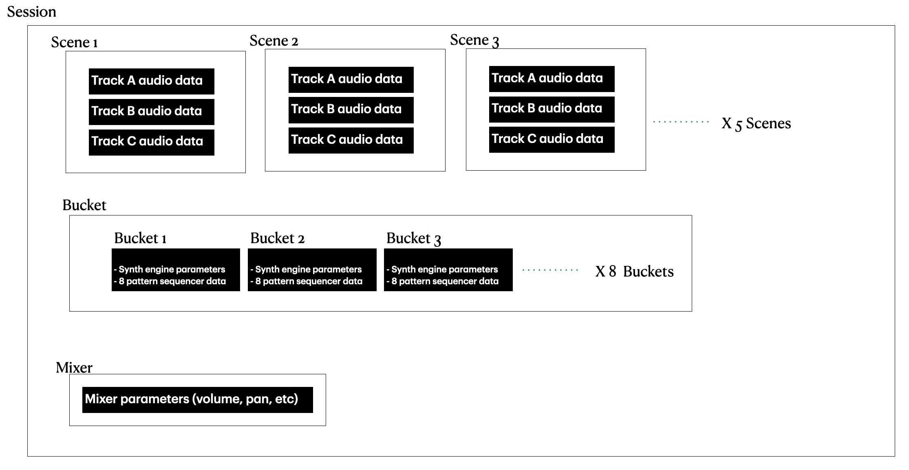

Session is the biggest data unit of the synth.
Session includes 8 preset buckets. Each bucket contains one preset with 8 pattern sequencer data.

There is no "new session" function. The synth always create a new session when booting. Reboot the device to create a new sesion.

Session button operations work in Parameter mode or Play mode

Button | Function
------------ | -------------
SHIFT + LOOPER PLAY | Show current session number
SHIFT + LOOPER PLAY + Turn Dial | Load session
NO or OK button while selecting a session | Scroll session page when you have more than 32 sessions 
SHIFT + REC | Save current session (Looper stop will perform session save when autosave is on)
SHIFT + REC (Long press) | Name current session
SHIFT + REC + B[1-3] | Load WAV file to looper track A, B or C (See [Looper Overview](#looper-overview) section for details)
Press B[1-8] while booting | Load a previous LOOPER folder. E.g. Button1 means LOOPER00, Button2 means LOOPER01, and so on.

To load a session, press SHIFT + LOOPER PLAY when you are not in System mode or Granular mode. Current session number "Looper00:0001" will be indicated. Turn the dial to select the session you want to load.

Saving session is semi-automated.
Looper recording data will be saved immediately after the recording. 
Mixer and Bucket data will be saved when the LOOPER STOP button is pressed.
This can be turned off in the System2 menu.

## Initialize Preset

You can initialize a preset by pressing SHIFT + PARAM.
Several preset templates are available when initializing: Blank, Sampler, EvenSlice, and Scratch. Blank is the base preset for all.

The following parameters will be set when you select other templates:

**Sampler** : Sampler is for basic sampler setup.
- OSC1 type = AUX L
- OSC Octave = +1
- Granular mode = ONE
- Env1 Release to 58 for gentle release

**Slice**: Slice is good for one-shot multiple slicing.
- OSC1 type = AUX L
- OSC Octave = +1
- Granular mode = ONE
- Env1 Release to 58 for gentle release
- OSC1/2 Keysync is disabled (1N2N)
- Slice Spread is set to 1 (Each semitone from C4 will play different slices)

**EvenSlice** : EvenSlice is for sampler with evenly slicing samples.
- OSC1 type = AUX L
- OSC Octave = +1
- Granular mode = ONE
- Env1 Release to 58 for gentle release
- OSC1 mod src = FREQ1 to modulate PWM by MIDI note
- OSC2 mod src = FREQ2 to modulate PWM by MIDI note
- Keysync = 1N2N to disable pitch control by MIDI note

*EvenSlice expects to change OSC1 MOD WIDTH to control the size of the slice.*

**Scratch** : Scratch is for vinyl record scratching mode. 
- OSC1 type = AUX L
- OSC Octave = +1
- Granular mode = ONE
- Env1 Release to 58 for gentle release
- Env1 Src = ON

## Preset Bucket

The synth has 8 preset buckets to quickly recall presets. Each bucket contains one preset and 8 sequencer patterns.

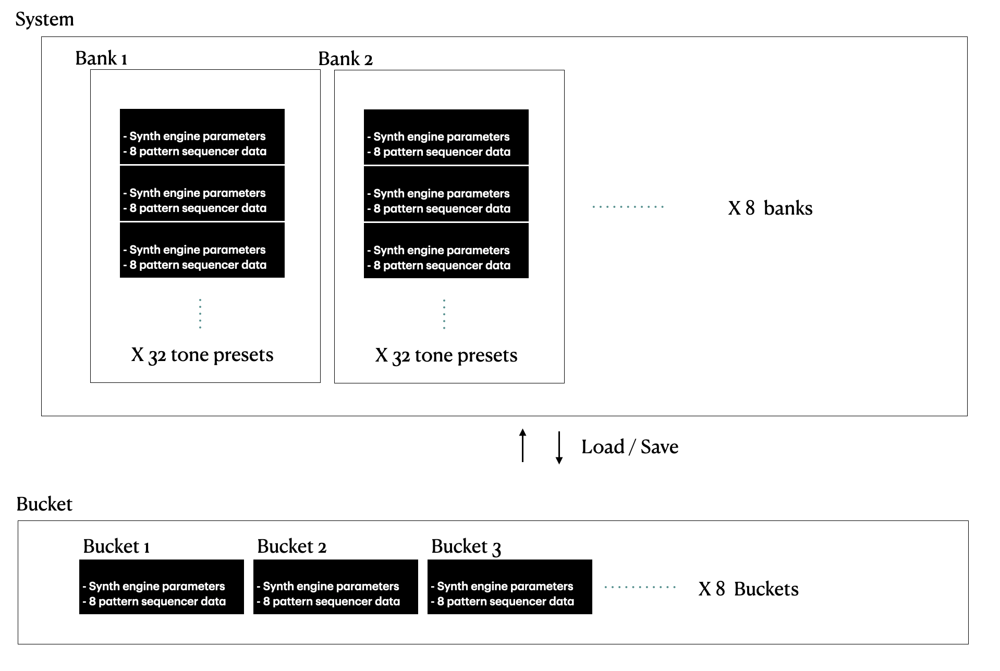

Buttons | Description
-------|-------
MODE PLAY + B[1-8] | Switch Bucket
MODE PLAY + B[1-8] + turn dial | Copy Bucket

Solid LED indicates current bucket you are in when pressing MODE PLAY button.

Bucket information is automatically saved with Session. 


To understand how bucket works, try the following steps:

1. Reset the board
2. Change some parameter to configure the sound, let's set it to Sine wave.
3. Press Recall(Mode/Play) + Button 2 to switch Bucket 2
4. Then the sound should be changed to the default SAW wave.
5. Change some parameters to program, let's set it to White noise.
5. Press Recall + Button 1 to switch back to Bucket 1
6. The first sound you configured should be recalled.
7. Press Recall + Button 2 to switch to Bucket 2 again
8. White noise should be recalled.

When you save the preset or load the preset from bank 1 to 8, its name is used to indicate the bucket, so it is always recommended to set a name by saving or loading the preset.


## Signal diagram

_A sequence of [video segments](https://www.youtube.com/watch?v=7dNhxKBtwPo&t=230s) is available introducing several of the diagrammed stages._

Signal diagram helps to understand how Qun mk2 works.

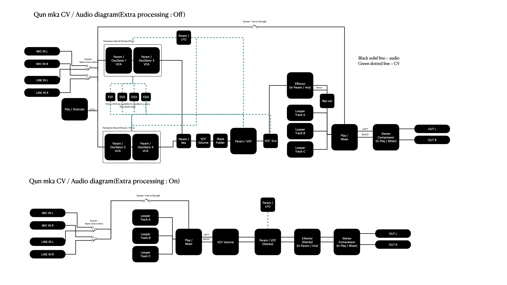

# Parameter Mode (Param)

## Adjust synthesis parameters
To operate, press B[1-8] to choose a parameter and rotate dial to change its value. The parameter display area will temporarily invert. A parameter's position in the display corresponds to the visual button assignment:

```
 1  3  5  7
 2  4  6  8
```

E.g. button 1 chooses the wave SHAPE parameter when in the OSCILLATOR1,2 sub-mode.


## PRM:OSCILLATOR1,2

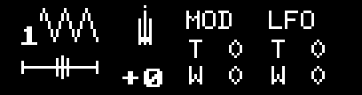


The oscillator is a hybrid of classic analog synth, FM, and granular.

Buttons | Description
-------|-------
1 | SHAPE. `Saw, Sine, S&H, Square, Triangle, W Noise, P Noise, FM, AUX`.<br> * AUX means audio input from LINE or MIC. <br> * Granular synth engine is connected to the AUX L channel when it's active. See [Granular](#granular) section for detail. 
2 | PULSE WIDTH.  Triangle, Square and Granular can take PWM. In granular mode, the playing position will be changed by PWM.
3 | TUNE
4 | OCTAVE
5 | MOD TUNE. MOD modulation to tune. Default MOD source is EG1.
6 | MOD WIDTH. MOD modulation to pulse width.
7 | LFO TUNE. LFO modulation to tune.
8 | LFO WIDTH. LFO modulation to pulse width.

### Pulse Width Modulation (PWM)

Qun supports PWM. It affects Square wave oscillations normally: changing the duration of the pulse of the wave. It affects other waveshapes in the following ways:

- Triangle: Adds harmonics as well as DC bias
- Granular: Changes playing position
- Sine: Adds wavefolding for harmonics


## PRM:MIX

_A sequence of introductory [video segments](https://www.youtube.com/watch?v=7dNhxKBtwPo&t=400s) is available._

Mix controls mixer and effects.

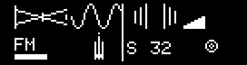

Button | Description
-------|--------
1 | OSC MIX. Balance between OSC1 and OSC2
2 | FM modulation OSC2 to OSC1
3 | VCF Volume.  Input gain to VCF 
4 | Line In / Mic gain
5 | Effect type . Off, Delay, Chorus1, Chorus2, Flanger1, Flanger2, Crusher (Bit crusher), MDelay(Mono delay), DDelay(BPM Synchronized digital delay), RSVD(Reserved for the future update) 
6 | Effect Speed. Controls Effect LFO rate or delay time. 
7 | Effect Depth
8 | Effect Feedback

### Effector tips
- The Delay speed can be set very short. Create an interesting simulation of flute or violin by using a very short delay. Mono Delay will work better for the use of delay as a resonator.
- You can widen the stereo image by using a short delay. 
  - Effector Type: Delay
  - Speed: Around 30
  - Depth: Around 30
  - Feedback: 0
- Digital delay is BPM synchronized. It also can be used as beat repeat by setting 100% of feedback, and 100% of depth.

## PRM:ENV1/2

_An explanatory [video segment](https://www.youtube.com/watch?v=7dNhxKBtwPo&t=290s) is available._

The synth has four Envelope generators. ENV1 and ENV2 are both independently and fully configurable. ENV3 and ENV4 share parameters. ENV3 / ENV4 is connected to FM operators when it's configured via FM ENV3 CONN.


Button | Description
------------ | -------------
1 | ENV1 Attack
2 | ENV1 Decay
3 | ENV1 Sustain
4 | ENV1 Release
5 | ENV2 Attack
6 | ENV2 Decay
7 | ENV2 Sustain
8 | ENV2 Release

## PRM:OSC Switches
Switches and modulation routing.

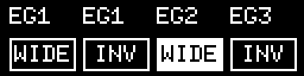

Button | Description
------|--------
1 | OSC1 Env(VCA) source
2 | OSC1 Wide tune switch. When it's on, OSC1's tune reacts much more sensitively.
3 | OSC1 Modulation source
4 | Env1 invert switch. Modulation will be affected in the opposite way, and amp gain will be (1.0 - Envelope). 
5 | OSC2 Env(VCA) source
6 | OSC2 Wide tune switch
7 | OSC2 Modulation source
8 | Env2 invert switch 


## PRM:LFO


Button | Description
-------|-------
1 | LFO SHAPE.  `Saw, Sine, RevSaw, S&H, Square, Triangle, AUX, OSC2, OSC2EG`. OSC2EG is the signal from OSC after Envelope Generator processing.
2 | LFO PULSE WIDTH. When it's applied to the SAW wave or SINE wave, it will affect phase offset. It is useful with BPM sync and retrigger. 
3 | LFO TUNE
4 | KEYSPLIT. This is a unique feature of the synth. When it is not zero, then thenote number above the parameter becomes the LFO rate controller. If you set 60, then C4 or higher notes control LFO: higher notes will generate higher LFO rates. If you press multiple notes, it doubles and triples the rate, which can be great for live performance.
5 | LFO MOD TUNE. MOD modulation to tune.
6 | LFO MOD WIDTH. MOD modulation to pulse width.
7 | LFO MOD Source. `EG1, EG2, EG3, EG4, AUX, OSC2, OSC2EG, FRQ1, FRQ2`
8 | LFO Retrig. LFO’s phase is reset by every note hit when it is ON.

## PRM:VCF

_A sequence of [video segments](https://www.youtube.com/watch?v=7dNhxKBtwPo&t=480s) is available demonstrating the VCF, including the important VCF Volume parameter._

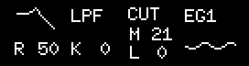

Button | Description
------|-------
1 | CUTOFF
2 | RESONANCE
3 | VCF TYPE `LPF,BPF,HPF,Notch`.
4  |VCF KEY SYNC. When it is not zero, VCF’s cutoff will follow the playing note. Higher value is more sensitive.
5 | VCF MOD CUTOFF. MOD modulation to cutoff. 
6 | VCF LFO CUTOFF. LFO modulation to cutoff.
7 | VCF MOD SRC. MOD modulation source : `EG1, EG2, EG3, EG4, AUX, OSC2, OSC2EG, FRQ1, FRQ2, ON`.
8 | VCF LFO Volume. LFO modulation to VCF’s input volume. It can be used as a vibrato effect.

## PRM:KEY/OTHER

Configures other parameters.


Button | Description
------ | ------
1 | VCF 4/2 POLE / NoLinear. Select VCF number of poles and linear or no linear. 2P/4P/2PNL/4PNL. Ladder filter algorithm will be used only when 4NL with Lowpass or Highpass filter.
2 | VCF ENV Src. Applying Envelopes to the signal after VCF. You might want to set OSC1/2's Env sel to "ON" to utilize this parameter. This is useful only with Mono mode. _A tutorial [video segment](https://www.youtube.com/watch?v=7dNhxKBtwPo&t=672s) is available._
3 | GLIDE. Smooth transition between notes. Works with Mono.
4 | BEND RANGE. Pitch bend range.
5 | OSC1/2 Keysync. This is a switch to connect MIDI input notes and oscillators. Y = Follow MIDI note pitch. N = Ignore MIDI note. You can still use FREQ1 and FREQ2 for modulation to use MIDI note pitch.
6 | VELOCITY SW. Envelope generators become velocity sensitive when it’s ON.
7 | MONO/QUAD/POLY (Voice mode). Long press to sync Oscillator parameters. See the [Voice Mode](#voice-mode) section for details. 
8 | LFO BPM sync. LFO rate will synchronize with Sequencer's BPM when it is ON.

### Voice Mode

_An explanatory [video segment](https://www.youtube.com/watch?v=7dNhxKBtwPo&t=110s) is available._

One synthesizer can be used as Monophonic or Quadphonic.

- Mono = 2 OSCs for 1 voice
- Quad = Quad Tone: 1 OSC per voice, and the engine has total 4 oscillators for the extra voices
- PolyMono = 2 OSCs per voice, but you can get 2 voices
- PolyQuad = 1 OSC per voice. It's for Polyphonic setup when you have multiple Qun synthesizers.

When the mode is Quad or Poly Quad, MIX  and "OSC2 Env Src" are ignored. MIX is always set to middle, and OSC2 Env Src is always set to EG2. In most cases you may want to use the same parameters between OSC1 to OSC2 with Quad mode. 
To copy the parameters from OSC1 to OSC2 (and EG1 and EG2), long press button 7. "OSCs synched" message will be shown. 
	
Here is an example to set up Quad mode:

	1. Initialize tone.
	2. Configure OSC1 as you like.
	3. Set this parameter to "Quad" mode by pressing button 7.
	4. If you want to copy OSC1 parameters to OSC2, in the same sub-mode, long press button 7 until the "OSCs synched" message is shown.
	5. Play two notes by external MIDI keyboard. You will hear four voices.


Poly Mono can be used when you want 2 voices with 2 OSCs per voice configuration.
	
Poly Quad is for multiple device stacked configuration. You can use multiple Qun Synthesizers to build a polyphonic synth.
	Please see “Polyphonic setup” for detail.


## PRM:FM
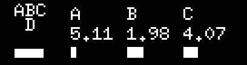

The synth has 2 x 4 operator FM engine. OSC1 or OSC2 can be set to FM mode.
Each operator has a sine wave.
OSC1 and OSC2 share the FM parameter.

Button | Description
-----|-----
1 | FM Algorithm
2 | D Amplitude
3 | A Frequency
4 | A Amplitude
5 | B Frequency 
6 | B Amplitude 
7 | C Frequency 
8 | C Amplitude 

FM ALGORITHM

"ABCD" indicates each operator.
Vertical relationship means upper operator modulates lower operator.
For example,

```
	    A
	B C D
```
This means that operator A modulates operator D. B, C and modulated D will be mixed in parallel.
```
	A
	B
	C - D
```

This means A modulates B, the result modulates C, the result modulates D.


Oscillator (ABC)’s frequency (multiple of frequency of D).
	When FM FREQ SNAP (In ENV3/4 Other sub-menu) is off, it can be adjusted to the exact frequency of harmonics (2,3,4,5..). If you want clean FM sound, turn FM FREQ SNAP on.

## PRM:ENV3/4 / Other

_An explanatory [video segment](https://www.youtube.com/watch?v=7dNhxKBtwPo&t=480s) is available demonstrating wavefolding with ENV3/4 in the context of the VCF Volume parameter of the Mixer._


Button | Description
--------|--------
1 | 2ND FILTER. See the [2nd Filter](#2nd-filter) section for details.
2 | FM FREQ SNAP SW. Frequency snapping for FM. When it's ON, FM frequency will be snapped to numbers. When it's OFF, FM has more character, the signature sound of the QUN synth.
3 | Wavefolding. Wevefolding curve selection. This filter is located in VCF.
4 | FM ENV3 CONN. Select FM operator(s) to connect ENV3/4. After the processing, it will be filtered by ENV1 or ENV2.
5 | ENV3/4 ATTACK
6 | ENV3/4 DECAY
7 | ENV3/4 SUSTAIN
8 | ENV3/4 RELEASE

### 2nd Filter

_A brief [video segment](https://www.youtube.com/watch?v=7dNhxKBtwPo&t=650s) is available._

Second filter can be used when you use the 2 POLE filter for VCF. It's disabled when 4 POLE is selected. It provides additional shaping of the sound. 

Mode | Description
------------ | -------------
NC200 | Notch filter at 200Hz. It will remove some muddy.
NC1K | Notch filter at 1kHz. It will remove some highs.
LS100 | Low-shelf at 100Hz. It will boot bass without cutting high.
LS150 | Low-shelf at 150Hz. It will boot bass without cutting high.
LS200 | Low-shelf at 200Hz. It will boot bass without cutting high.
LS300 | Low-shelf at 300Hz. It will boot bass without cutting high.
HP80 | Highpass at 80Hz. It will remove low-end bass to get more clear sound.
LP4K | Lowpass at 4kHz. It will remove high-end.
PK100 | Peak filter at 100Hz. Similar to band-pass filter, but Peak filter boots the peak frequency but it will not cut other frequencies like band-pass filter.
PK150 | Peak filter at 150Hz.
PK200 | Peak filter at 200Hz.
PK300 | Peak filter at 300Hz.
PK400 | Peak filter at 400Hz.
PK800 | Peak filter at 800Hz.


# PLAY MODE

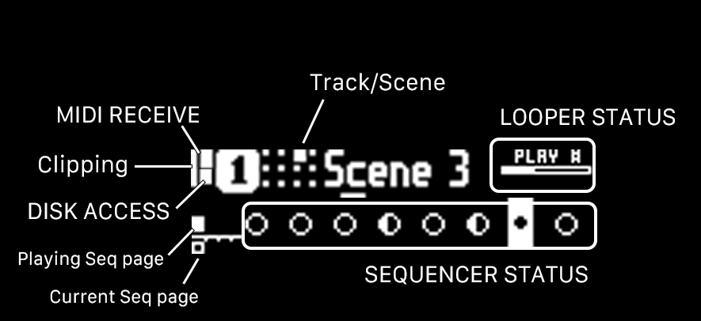

Disk access indicator is active when the system is accessing the SD card. Some actions are restricted while writing.

Track / Scene tile shows selected track (A,B or C) and Scene number (1 to 5).

Looper status shows Looper position and status.

Clipping indicator is active when signal is clipped at the end of signal chain, after compressor.

## COMMON SEQUENCER OPERATIONS

Most actions work in any major mode, and are not limited to Play mode.

Button | function
-------|-------
SEQ PLAY | Start / Stop Sequencer
REC + SEQ PLAY | Start Sequencer live recording
REC + SEQ PLAY + turn dial | Metronome volume
SHIFT + SEQ PLAY + turn dial | Set BPM. Tap tempo by pressing SEQ PLAY 4 or more times while you keep pressing SHIFT. 
NO | Previous sequencer pattern
OK | Next sequencer pattern
SEQ PLAY + [1-8] | Select Sequencer pattern
SEQ PLAY + [1-8] , [1-8]...| Chain sequencer pattern(Pattern chaining). Keep pressing SEQ PLAY. 
SEQ PLAY + NO / OK | Move to previous / next Sequencer page
SHIFT + SEQ PLAY +  NO / OK | Copy Sequencer page to previous / next Sequencer page
SEQ PLAY + [1-8] + turn dial | Copy sequencer pattern to other pattern. If you want to cancel the operation, turn to the end, then "CANCEL" will be indicated as the destination. To initialize the bank data, turn the dial to "CLEAR". 

## COMMON LOOPER OPERATIONS

Button | function
-------|-------
REC | Go Looper status page
LOOPER PLAY | Start Looper
LOOPER STOP | Stop Looper
LOOPER REC + LOOPER PLAY | Start looper recording
LOOPER PLAY + [1-5] | Select Scene
LOOPER PLAY + NO or OK | Change Scene page (5 Scenes per page)
LOOPER PLAY + [1-5] + Dial | Copy Scene
REC + [1-3, 7,8] | Select recording track. A,B,C are mono tracks. Press 7, 8 for stereo recording. 7=A(Left)+B(Right), 8 = B+C. When you do stereo recording, you may want to set pan to left and right for the selected stereo tracks. 
SHIFT + REC + B[1-3] | Load WAV file to looper track A, B or C. Importing WAV file to the looper section for detail. 
PARAM + [1-3] | Mute track
PARAM + NO | Toggle Extra Processing
SHIFT + LOOPER STOP | Delete all track recordings in the current scene, reset recording length 
REC + NO | CUT Looper track
REC + OK | PASTE Looper track
REC + PARAM | Open UNDO list. Select the top item to undo the last recording for the track. Shift + OK to preview the sound. 
MODE PLAY + PARAM + Turn Dial | Parameter Lock Morphing

## Sequencer overview

_A [tutorial video for the sequencer](https://www.youtube.com/watch?v=vZqdzkTQ1Mg) is available._

The sequencer is an 8/16 step sequencer. One page has 8/16 steps and it can have up to 4 pages.

The sequencer UI is influenced by analog 8 step pattern based sequencers. You turn can on and off patterns, and change parameters for the steps. 

Sequencer data will be saved when you save tone presets, and it is saved with the Session. Each preset can have 8 sequencer patterns.

You can run multiple sequencer at the same time, up to three patterns, as normal parallel running or relative running. See PLY:SEQ CONFIG for detail.

### Sequencer live recording

You can record live playing to the sequencer. Rec + SEQ PLAY to start recording. Play on Piano mode or play with an external MIDI keyboard to record notes. It's always overdubbing.  Note, Width(length), and velocity will be recorded.
Sequencer playing position indicator changes when live recording.
	Normal:
	
	Live recording:
	
Also, all LEDs are on for the even steps while live recording.
Press SEQ PLAY to exit recording mode, and the sequencer will keep playing. Press SEQ PLAY again to stop the sequencer.

You can (re)enter recording mode while playing. Press Rec + SEQ Play to enter recording mode.

A metronome click sound plays when live recording is ongoing. The metronome volume can be adjusted with REC + SEQ PLAY + Turn dial. The chained sequencer pattern will be reset when you change to another pattern.

When you are in sequencer live recording, changing sound engine parameters will be recorded as Parameter Locking.

### Edit the current step while Sequencer live recording

When you are in Tune, Width, Velocity, or Prob mode, and you are also in sequencer live recording, pressing B7 + B8 will specify the current step. The "Current" message will be shown.

While you are pressing B7+B8, the dial position will be recorded to the current playing position.


## Parameter Locking

_An intermediate [tutorial video](https://www.youtube.com/watch?v=wyU148xfGao&t=275s) is available._

Parameter locking is the term used in Elektron sequencers, which is a temporary parameter change available only in the specific sequencer step. The parameter change appears only when the sequencer is playing the step. 

Here is the steps to set Parameter Lock:

1. In Play mode, you should be one of the following modes: ON/OFF, Tune, Width, Velocity, or Probability, press [1-8] button to select the step that you want to set Parameter Lock
2. Keep pressing the button, and press [PARAM]. Mode switches to Parameter Lock mode.  White frame indicates you are in Parameter Lock mode.
3. Change the parameters that you want to change. Once the parameter is changed, the parameter area will be inverted, indicating the step is modified.
    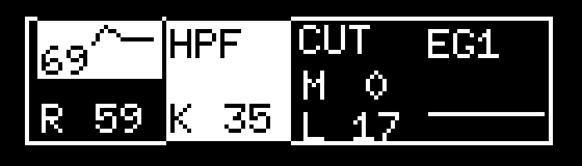
4. You can set up to three parameters to modify.
5. To finish the editing, press [PLAY] to go back to the sequencer page.
6. You will see [""] mark at the top of the step when the step has Parameter Lock.
    
7. To reset the modification, long press [1-8] button + [PARAM] when entering Parameter Lock mode, or long press [PARAM] when in Parameter Lock mode. If you press multiple buttons for the steps, multiple steps will be cleared.
8. Once you change one parameter, you can change the last edited Locking parameter by pressing [1-8] + [PARAM] + Turning dial without re-selecting the parameter.
9. When you are in sequencer live recording, changing sound engine parameters will be recorded as Parameter Locking.

Parameter lock will be triggered only when the step is turned on.

Shift + turn dial is a useful way to sweep between sub-modes to find modified parameters.


## Parameter Lock morphing

You can morph Parameter Locking between two patterns.

1. Let's say you are in pattern 1. Set Morph Pattern in Sequencer configuration menu. Set the Morph pattern to 2 by long pressing button 4.
2. Copy pattern 1 to 2 with SEQ PLAY + [1-8] + Turn dial
3. Move to pattern 2
4. Modify the Parameter Locking in pattern 2
5. Go back to pattern 1
6. Morph can be done by pressing [MODE PLAY] + [PARAM] + Turn dial

## Looper overview

_A [tutorial video](https://www.youtube.com/watch?v=iD4WpX3tHUE) is available._

The looper is designed to work with the sequencer. The looper always tries to sync with sequencer play. Looper won't start playing when the sequencer is not running. Use a blank sequencer pattern when you don't want to make sound from the sequencer.

To start looper recording, hit LOOPER REC + LOOPER PLAY. If the sequencer is not running, it will not start recording, but it is standing by for recording. In this case, press SEQ PLAY to start recording. When the sequencer is playing, the recording will be started at the beginning of the next measure.

The first recorded track will define the length of the loop.

Press LOOPER STOP to finish the recording. You don't need to press the stop button precisely -- you can press earlier, then recording will be finished at the end of the measure.

Looper keeps playing the recorded sound. All recorded data will be saved to SD card immediately.

When you press REC + LOOPER PLAY twice (or shift + REC + Looper play), the recording mode will be REC mode. In REC mode, it will overwrite the existing recording. It will change loop length when the new recording is longer than the existing one.

When you press REC + LOOPER PLAY 3 times or 4 times, it enters Insert Recording mode. See "Insert Recording" section for detail.

Looper has 3 mono tracks. REC + [1-3] button to select recording track. Each recording can go up to about 25 seconds. You can record a track as stereo by pressing REC + [7 or 8]. A(Left)+B(Right) or B+C will be selected. With stereo recording, you may want to set pan to Left and Right for the selected stereo tracks.

One set of recordings is called Scene. Looper has 20 Scenes. LOOPER PLAY + [1-5] to select the scene. LOOPER PLAY + NO or OK to change Scene page.

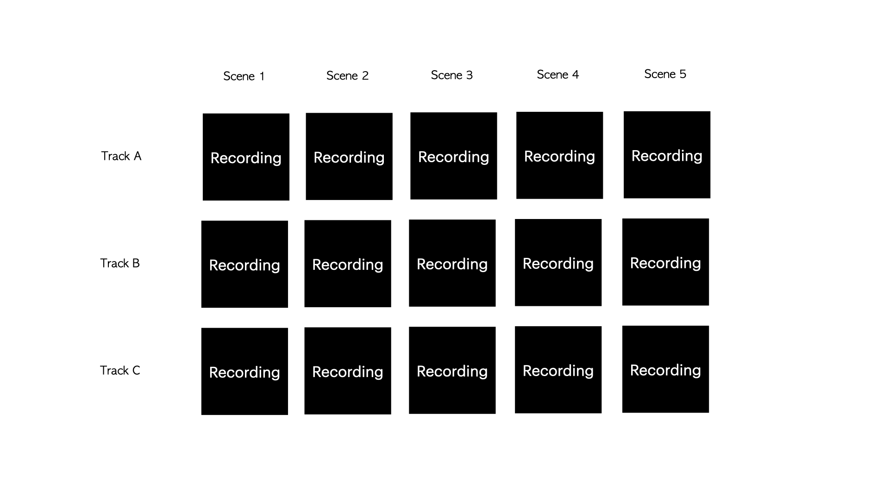

Reduce record volume (-3.0dB or more) in Mixer to avoid clipping. MODE PLAY + turn dial to change the value.

Cut / Paste can be used as a temporary saved area, or to delete the track. REC + NO to Cut, REC + OK to Paste.

All recorded data, Preset bucket and Mixer data will be saved as a Session automatically. Recording data is saved immediately and other data will be saved when looper playing is stopped. Recording data is a standard WAV file so you can import them to DAW.

## Looper status page

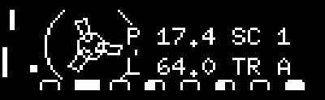

You can check looper status such as playing position and Looper length by pressing the REC button.

Label | Description
------------ | -------------
Big letter top left(Not shown in the screenshot) | Indicator of Overdub, Rec or Insert 
Small dot on bottom left | Ready to play, waiting for sequencer, or already playing
Another circle line in the tape | Extra Processing is on (PARAM + NO) 
P | Position (steps) 
L | Loop length (steps) 
Box and lines above SC label | Scene page
SC | Current Scene
TR | Current Track

## Insert recording

_An [introductory video](https://www.youtube.com/watch?v=N8N1X59RaVg) is available._

When you press REC + LOOPER PLAY 3 times, it enters Insert recording mode, this allows to record external effector result back to the looper. For example, you can apply reverb if you have a reverb pedal.

Setup is the following:

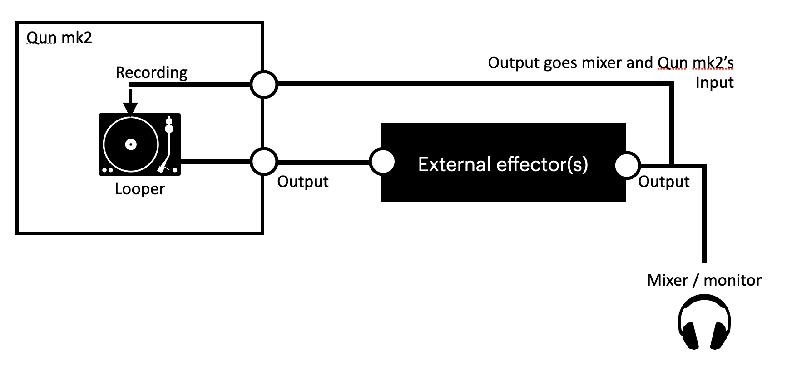

You need to separate effector's output, one goes out to mixer/monitor and the another one is connected to Qun's input. Or use mixer's one of output if your mixer has multiple outputs.

AUX in gain (MIX sub-mode, button 4) to adjust the recording volume.

Here are the steps to do insert recording

1. Listen to the output with external effector ON, make sure effector is on, and the sound comes back to the input. Mute tracks or sound engine that you don't want to record. **You can check AUX input level in Monitor mode, page 2.**
2. Select recording track. REC + B[1-3] or B[7-8] for stereo. 
3. **REC + LOOPER PLAY 3 times or 4 times** to activate Insert recording mode. "InsertRec" or "InsertOvb" message will be shown, or You will see "IO" or "IR" indicator if you are in Looper status page.  "IR" mean Insert Recording,  it will overwrite existing recording which is normally you may want. "IO" means Insert Overdub, it will overdub to the existing recording.
4. When you select "IR", remember the loop length if you don't want to change the loop length.
5. Start recording by starting the sequencer.
6. Stop recording at the desired record length.
7. The audio with effector should be recorded to the selected track. Check the result by turning off the external effector(s).

Tips:
	- Playing track and recording track can be the same.
	- You can enable Extra Processing for additional effects if you want.

## Importing WAV file to the looper

You can import WAV files to the current session. Put WAV files under the **/import** folder. Folder structure is supported so you can make subfolders to organize samples.
WAV format has to be **16-bit, 48000Hz, Mono**. Otherwise "Format error" message is shown.

Steps to import file:

1. Set BPM that you want
2. **SHIFT + LOOPER PLAY + B[1-3]**. [1-3] buttons correspond to the destination track.
3. Dial or button 7 or button 8 to select file.
4. Button 5/6 for horizontal scroll for long filename
5. Select file, **OK** to import. **SHIFT + OK** to preview the sound.

The data is trimmed to the closest the end of the measure.

You can control the looper and sequencer while you are in the file selection mode. 

BPM can be matched when BPM is detected from the filename. Here are some samples that Qun can detect:

- `drumloop_120.wav`  (120BPM)
- `guitar_120_01.wav` (120BPM)
- `01_vocal_loop_160BPM_e5.wav` (160BPM)

If you have existing recordings in the session, the WAV file will be cut to the current scene's looper length. You can use an empty recorded track just to cut the WAV file to match the loop length. Otherwise it's trimmed to the longest point of the end of the measure.


## Looper live playing / Partial scene switch

Scene is powerful feature. You can play looper like Ableton Live's Session view. 
Play sequencer and looper, then LOOPER PLAY + [1-5] to select scene. Scene will be switched at the end of the measure. Synchronized switching works only when sequencer is playing.
You can switch Scene even if it's not the end of the recording. Changing point is the end of sequencer's measure.
Normally all tracks moves to new Scene, however, you can partially switch scene as well. Press LOOPER PLAY + [6-8] + [1-5]. [6-8] buttons tells which tracks you want to switch, and [1-5] is the scene number. Looper length can be different.
PARAM + [1-3] to mute tracks. 

Use Preset Bucket to keep preset settings. You can recall tone preset and patterns in a sec by using Preset Bucket.


## PLY:PLAY PIANO

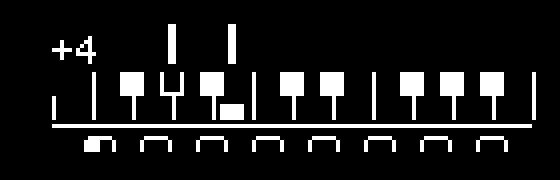

The mode is simple piano playing mode. Default is chromatic scale, but the scale and key can be changed by the scale setting in SEQ Config mode. Turn dial to transpose.

### Temporary piano mode
You can activate Piano mode anytime by keep pressing SYSTEM + [1-8] button. You can change transpose by turning dial once piano mode is activated.


## PLY:SEQ MODIFY
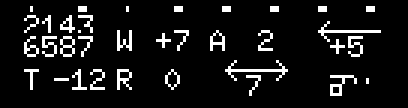

This controls modifier of the sequencer pattern.

Button | Function
------------ | -------------
1 | Pattern shuffle. 
2 | Transpose.
3 | Width Offset (note length). / Long press for playing Pattern shuffle
4 | Note Randomness
5 | Arpeggiator
6 | Rewind Period 
7 | Rewind Steps 
8 | Apply modifiers to the current sequence page 

The Modifier is powerful feature, it will give algorithmic effects to the pattern. Those effects will be applied to current pattern without breaking the pattern data.  Also you can apply modifiers to the pattern to make the effect as permanent.

- Transpose will add offset to the pattern. Scale quantize (SEQ Config button 3) will help to keep the result musical.
- Width Offset will change the note length.
- Randomness will add some randomness to playing notes.  Scale quantize (SEQ Config button 3) will help to keep the result musical.
- Arpeggiator will add note offset. Scale quantize (SEQ Config button 3) is important to generate usable Arpeggiator result.
- Pattern Shuffle will shuffle the playing order of the pattern. It is not random shuffle, so you can make creative and unexpected result without randomness.
- Rewind period and Rewind steps define the periodical rewind of the sequencer. However, the step goes back to 1 when playing count reaches the length of the pattern.

You can permanently apply the modifiers by pressing button 8. The result will be stored to selected sequence page. If you want to apply only partial steps of the page, you can press [1-8] buttons to unselect steps. Press OK to apply the modifiers while pressing [1-8] buttons. 

You will be asked resetting the modifiers or not resetting the modifiers. If you don't reset modifiers, then the modifiers will be reapplied to the result, so resetting modifiers is recommended to avoid confusions.

If the pattern has more than 8 steps, the modifier will be applied to only the current page. If you want to apply the modifiers to all pages, you don't want to reset modifiers.

After you applied the modifiers, the modifier values would be reset. Apply is powerful tool to create generative pattern.


## PLY:SEQ ON/OFF
The sequencer has 8 steps per page, but it has more modes than ON/OFF.
You can set different type of notes by turning dial while you press the button.

Status | Meaning
------------ | -------------
Left-filled circle | One note in the step.
Right-filled circle | One note in the step but it plays at the second half.
Fully-filled circle | Two notes in the step (1/16th).
Striped circle | 3 notes in the step (triplet).
Striped square | 4 notes in the step (1/32th)

## PLY:SEQ VELOCITY / WIDTH / PROBABILITY
Press one of the eight buttons and turn the dial, then it will modify velocity / width / probablity for each step.

If you press NO or OK while pressing [1-8] button, you can edit sub-step parameter.

Please check Seq Tune section about sub-step. 

Only tune has 3rd and 4th voice index. Other parameters will share the parameter for 3rd and 4th voices.


## PLY:SEQ TUNE
Press one of the eight buttons and turn the dial, then it will modify tune offset for each step.

If you press NO or OK while pressing [1-8] button, you can edit sub-step's parameter.

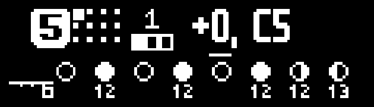

While you are pressing B[1-8] button, three tiles indidates sub-step position you are editing. The number above tiles means the index of the voice.
2 and more voice index works with Quad voice mode. For example, the following picture means you are editing 2nd position of the sub-step, and 2nd voice.


sub-step position | Meaning 
-------- | --------
Left | Main value, it will be used for the first-half note and other notes when other Index number is off
Middle | 2nd half of the note (Used with 1/16th note)
Right | 3rd of the note (Used with triplet)

### Playing note capturing from external MIDI keyboard

_A [demo video](https://www.youtube.com/watch?v=aV2YL0idMHA) capturing external MIDI notes using the legacy Qun mk1 pocket synthesizer is available._

Alternatively, you can step record notes by external MIDI keyboard. Play note by MIDI keyboard while you are pressing one of the eight buttons, the note will be recorded as the tune for the step. Chord playing can be captured as well.

## PLY:SEQ CONFIG

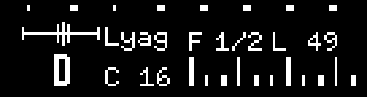

Button | Function
------------ | -------------
1 | 16th Swing / Long press for Sequencer MIDI channel out. Long press button 6 for 8th swing. Combination of 16th and 8th swing is great for sloppy off-grid feeling. 
2 | Key (for scale). / Long press for 2nd pattern 
3 | Scale. Playing note will be quantized by this scale. / Long press for 3rd pattern 
4 | Sequencer loop count. Default is 8.  / Long press for Morph pattern.
5 | BPM factor. Playing speed can be double, normal, 1/2, 1/4 or 1/8.  / Long press for note Lower Limit 
6 | Velocity accent period (steps). / Long press for 8th swing 
7 | Velocity for the non-accent notes. / Long presso for note Upper Limit 
8 | Velocity accent Period Offset 

Velocity period settings (Button 6 - 8) provide a convenient way to make rythmic velocity.

Sequencer MIDI channel out is useful setting with external synthesizer. When you set it, the sequencer starts to emit MIDI out signal to external synthesizers. If you set Channel + "N" such as "1N", it won't trigger internal sound engine.

Morph pattern is used for Parameter Lock Morphing. Please refer "Parameter Lock Morphing" section in this manual.

Note lower and upper limit will limit the range of note. When the sequencer received a note that is out of the range, it will shift octave to fit within the range. It is useful to prevent to go too high note with randomization. It's also will do automated chord inversion.

### Running multiple sequence patterns
You can run multiple sequeence patterns at the same time, up to 3 patterns by setting "2nd pattern" (Long press button 2) or/and "3rd pattern" (Long press button 3), or using the shortcut shown below.

Button | Function
------------ | -------------
2 in SEQ CFG sub-mode | Long press for 2nd pattern 
3 in SEQ CFG sub-mode | Long press for 3rd pattern 
SEQ PLAY + B[1-8] (Primary pattern) + B[1-8] (2nd pattern) in any sub-mode | This is a shortcut to select parallel pattern select. If you press another button while you keep pressing the primary pattern button, then it will be for the 3rd pattern(If you release the primary pattern button, it will become **Pattern chaining**). Assign the same pattern one more time to erase the assignment. Only normal parallel pattern ("R0") can be selected. 

The status is shown like this:

`2nd Pt : 2 R 4`

The first number is the sequence pattern number you want to run (1 to 8).
The second number after "R" means period length for relative pattern run.
**Select "R0" for the normal parallel run.**

**You can edit the second/third pattern while playing.** To do this, just select second or third pattern while playing. The primary pattern won't be changed.

If you select R1 to R8, the second (or third) pattern will run as relative pitch to the primary pattern.
In this setting, C5 is the center (zero). The sequencer will update the transpose every configured period (R1 to R8) by looking at the current pitch in the primary pattern.

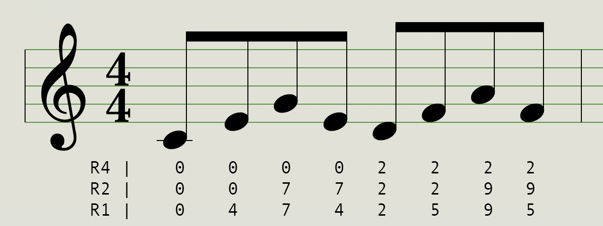

Let's say the above figure shows the primary pattern.

If you set "R4" for the second pattern, the transpose for the pattern will be updated every 4 steps. In this figure, 0-0-0-0 then 2-2-2-2 (The number is half steps).

If you set "R2" for the pattern, the transpose for the pattern will be updated every 2 steps. In this figure, 0-0 then 7-7, 2-2, 9-9 and so on.

**In relative run mode,  you need to specify tune for all steps, even for untriggered steps to tell the second/third pattern the transposing.**

the second/third pattern's scale will be ignored, and primary pattern's scale quantize will be applied.

## PLY: Granular


_Several videos of the Granular Engine are available: a [tutorial](https://www.youtube.com/watch?v=wEkmEXk_wRk), an [overview](https://www.youtube.com/watch?v=VE9lq5rr_YE) using the legacy Qun mk1 pocket synthesizer, a [brief demo](https://www.youtube.com/watch?v=BPVdobysstY), and a [wavetable-mimicing demo](https://www.youtube.com/watch?v=ssNfJuYejUM)._

### Overview

The synth features a Granular synthesis recorder.
- When GRN mode is set, ths Granular engine's signal is connected to AUX L channel. It means **Granular engine can be used as one of Oscillator shape**. You can assign Granular engine to Oscillator 1, and you still have Oscillator 2.
- You can have up to 8 slices when Slice Spread is not zero.
- You can record audio from LINE IN or MIC. Input sensitivity can be modified by "AUX In Gain" parameter in PARAM Mix menu.
- Pulse Width modulation will change File position (starting position) of the audio. That means the File position can be modulated by LFO and others.
- 4 Modes are available. **One shot, One shot with time stretch, Repeat, Repeat with time stretch**. 
- Time stretch result will be improved when you process "Analyze" on the sample (Button 1 and select "Analyze"). "A" mark will be indicated when it's done.
- With One shot mode, you can route the signal to OSC1 AUX L and OSC2 AUX L. 
- With initialized state of oscillator, +1 octave then C4 is the original pitch of the audio.
- The number of voice is limited in some Granular modes.

This is a simple setup to use the granular engine(You can skip those steps by initializing preset with "sample" or other template):

1. Move to Granular sub-mode
2. Change GRN mode from OFF to something else, for example "ONE" for oneshot. It overrides AUX L channel to Granular engine's output.
3. Record (REC + LOOPER PLAY) or import audio (SHIFT + LOOPER PLAY) for SD card.
4. Adjust parameters in Granular mode.
5. Go Oscillator parameter page, and select OSC shape to "AUX L"
6. Play notes, set Octave +1 if needed.

### Operation


Button | Function
------------ | -------------
1 | Process samples.  Analyze will give better result with Time stretch. See below list for processing  detail 
2 | Slice Spread, half-steps. Please see [Having Multiple Slices (Slice Spread)](#having-multiple-slices-slice-spread) section for detail. 
3 | File position (Starting point).
4 | Length
5 | Speed. It won't work with non-time stretch modes.
6 | Number of Grain. It won't work with One-shot modes.
7 | Detune. (Octave highs and lows)
8 | GRN Mode. OFF, ONE(One shot), ONE_TS(One shot with time stretch), RPT(Repeat), RPT_TS(Repeat with time stretch). When the mode is not OFF, It will override AUX L signal to granular output when you use AUX L as Oscillator shape. With time stretch, playing speed will be preserved. Without it, pitch and speed are linked like an analog tape. Execute Analyze(Button 1) for time streching modes. 
NO (<) | Previous slice
OK (>) | Next slice
LOOPER REC + LOOPER PLAY | Start recording granular sample
LOOPER PLAY | Start playing (Preview) 
LOOPER STOP | Stop playing
SHIFT + LOOPER REC | Save Recording data
SHIFT + LOOPER PLAY | Load Recording data from SD card.   Dial or button 7 or button 8 to select file.  **SHIFT + OK** to preview the sound. 

LOOPER buttons acts as sample player in granular mode.

#### sample processing

You can process samples.

Name | Description
------------ | -------------
Analyze | This will analyze sample, this will give better time stretch result.
Normalize | Normalize sample's volume
Reverse slice | Reverse current slice
Erase slice | Erase current slice (Filled with silence)
Cut slice | Cut current slice (Cut the region). It's useful to trim sample 
+3dB slice | +3dB current slice
-3dB slice | -3dB current slice


### Having multiple slices (Slice Spread)

You can have multiple slices. 

 To edit current slice, button 3 (Start point) and button 4(Length). NO or OK to switch between slices. If the slice length is zero then the following numbers of slices will be ignored.

When Slice Spread (Button 2) is set to more than zero, each slice 1-8 will be applied from the C4(60) note. One spread means half step.

**Setting the Slice Spread to 1 is the most common use**. Then the mapping will be the following:

	- C4 : Slice 1
	- C#4 : Slice 2
	- D4 : Slice 3

And so on. This is useful for drum kit, or simple sample slicing.

Let's have another example. If you have piano sample of C4 and F#4, then you want to set Slice Spread to 5. The mapping will be the following:

	- C4 : Slice 1 (Original pitch)
	- C#4, D4 : Slice 1 with pitch shifting
	- E4, F4 : Slice 2 with pitch shifting
	- F#4 : Slice 2 (Original pitch)

And so on. As you see C4 and F#4 has 5 half-tone distance. It can be used for melodic instrument with multiple sampling points.

In Repeat modes, multiple slicing points are randomly selected when the length is not zero.

### Live slicing

Live slicing (Making slices by pressing buttons while you are playing sample) can be done when you set GRN mode to ONE mode. Here is the steps to do live slicing:
1. Initialize a preset with "Slice" template. (Shift + PARAM and select "Slice"). Or setup the parameters by yourself. Make sure GRN mode is ONE.
2. Go Granular mode and load sample or record sample
3. Set the first slicing point to the head of playing piont and set length to 127(max), which is the default values.(We want to play the entire sample)
4. Press play button and **keep pressing the play button**. Loaded sample will play.
5. Press **B[1-8]** button to slice **while you keep pressing the play button**. B1 will set Slice 1, B2 will set Slice 2 and so on.
6. Length is set to 90 when the length is short. Adjust length and fine tune starting points as needed.

### Vinyl record scratch mode


Press SHIFT + Button 1 in piano mode one more time to enter record scratch mode.(Or SHIFT + turn dial in play mode)
Record scratch mode is an emulation of analog record scratching by using granular's sample buffer.

To use record scratch mode, you need to set the following settings, or using "Scratch" template from preset initialize menu:
1. Granular mode set to ONE
2. Select OSC1's shape to AUX L
3. Set OSC1's octave to +1
4. OSC1 Env Sel to "ON" (Parameter mode, Switch menu, button 1) to disable envelope. Or you can set it to other sources to automate crossfade slider.


Button | Function
------------ | -------------
Turn dial | Scratch record
Button 8 | Mute while pressing and unmute when released 
Button 7 | The same as button 8 
Button 6 | Release. Record start playing at the configured tune. 
Button 5 | Unmute while pressing and mute when released 
Button 4 | The same as button 5 
Button 3 | Rewind to slice 1 
Button 2 | Rewind to slice 2 
Button 1 | Rewind to slice 3 

#### Tips for record scratching

- Practice might be needed. Some real scratching technique is applicable until crossfader(=mute button) movement goes very fast. 
- Button 7,8 is useful for chopping, button 4,5 is useful for flare scratch.
- If muting is hard, you can automate muting by configuring envelope(EG's invert is on) or VCF volume. Set sequencer pattern for the automation and scratch on top of muting pattern.
- RPM is 33 1/2.
- The record icon and wave shape is helpful to figure out the playing position.
- Record rotates while you are pressing Release. If you keep turning dial to clockwise while pressing the button, the position will be kept. 


### Import WAV file to granular engine from SD card

You can import WAV file if you put WAV file under **/granular** folder in SD card. 

**The looper record data can be imported** as well. This will be shown at the end of the list at the root folder, so you can load looper recorded data to granular as well.

**Shift + Looper Play to import WAV file**, **Shift + Looper REC to export WAV file**.

1. Dial or button 7 or button 8 to select file.
2. Button 5/6 for horizontal scroll for long filename.
3.  **[SHIFT] + [OK] to preview the sound**.
4. The sample will be loaded to **the position of current region**

When granular mode is not OFF, the recording data will be saved when you save preset, so normally you don't need to save recording data here. It's designed to export recording data.


### Granular synth tips

- Execute Analyze for better result of time stretch
- Play note slur with One-shot mode. It works very well. You can keep the tempo with One shot with time stretch mode.
- PWM (Width) will change sample starting point, it will generate interesting result.
- Glide parameter is fun parameter with Granular.
- Speed can go negative.
- Set the following to do unpredictable wavetable. Change start position or Pulse width for fun.
	- granular mode to RPT
	- Grain to 1
	- Short GRN Length (Less than 30) 

## PLY:MIXER

Three track Mixer. At the last stage, signal can be **stereo** by panning tracks.

Button | Function
------------ | -------------
1 | Track A volume 
2 | Track A Pan
3 | Track B volume
4 | Track B Pan
5 | Track C volume
6 | Track C Pan
7 | Compressor threshold 
8 | Compressor makeup 
MODE PLAY + turn dial | Record volume 
SHIFT + MODE PLAY + turn dial | Record pan
MODE PLAY + SYSTEM + turn dial | Looper master volume 
SYSTEM + PARAM + turn dial | Cross fade between Record volume and Looper volume
SHIFT + NO | Toggle Monitor mode 


This mixer has a compressor. Ratio, attack time and release time are fixed (1:3, attack 30ms, release 100ms).

To turn off compressor, set Compressor threshold to zero.

See clipping incidator if you want to avoid clipping. The synth does soft clipping, so the clipped sound is preferrable sometimes.

Mixer setting will be saved when Session is saved.

### Monitor mode

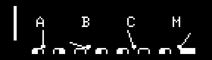

You can monitor the output.

Button | Function
------------ | -------------
B[1-8] | Toggle monitor page 

When you are in mixer mode, press SHIFT + NO again, or shift + turn dial to the end, you can enter to the monitor mode.


### Extra Processing

_An intermediate [tutorial video segment](https://www.youtube.com/watch?v=wyU148xfGao&t=725s) and [demo video](https://www.youtube.com/watch?v=RmhoXS-IHoA) are available._ 

This mode uses the sound engine as an effector to process external stereo input.

You can toggle Extra Processing mode by **PARAM + NO** button. 

When it's enabled, the Oscillators are turned off, but filter and effector becomes stereo, and connected to after Looper.
You can apply filter, filter volume, and effects against Looper recording. See the [signal diagram](#signal-diagram) to understand how it works.

LFO and Envelopes(EG1 to EG4) are still available for filter modulation.

Extra Processing can be recorded back to looper and this is powerful feature, you can bounce back looper recording with effects.

  1. Stop the sequencer
  2. Select the recording track
  3. Turn on Extra Processing (PARAM + NO)
  4. Set OVERDUB (REC + Looper Play once) or REC (REC + Looper Play twice) 
  5. Start the sequencer, and the looper starts recording
  6. Hit the looper STOP button to stop recording

The following parameters are still available with Extra Processing:

- All parameters in VCF sub-mode
- VCF Mod Sel
- VCF Volume
- 2 / 4 POLE
- 2nd Filter (When VCF is 2 POLE)
- All parameters in LFO sub-mode
-  Effector parameters (Type, Speed, Depth and Feedback)
-  VCF ENV Src

# SYSTEM MODE

(**UI changed since v4.52**) System mode will show the following menu. Turn dial or button 7/8 to move cursor, OK to select:


Menu | Function
-------- | --------
Load Preset | Load preset
Save Preset | Save preset
System | Enter system sub-mode 
System2 | Enter system2 sub-mode 

## Load Preset

**If your firmware is older than v4.52, please update to match this document.**

Each folder can store up to 40 presets. There is no difference between factory preset and user preset.

Factory presets are stored under under category names or a legacy folder structure, e.g. `bank1`, `bank2`, ... `bank8`.

**Note: The SD card template is updated for firmware v4.52 and later - this offers an improved preset load/save UI. If you see category names like Bass or Drums but nothing inside, you need to download sd_template.zip (see under Links and Information) and extract the folders and files. Then copy folders and preset files under the `/preset` folder.**

If you edit SD card, you can create your own folders. Only one depth of folder is supported.

Sequencer data will be stored with each preset.

Granular recording data will be saved when granular mode is not OFF.

Using the Preset Select menu:

Button | Function
-------- | --------
Dial | Move cursor
Button 7 | Move up cursor, SHIFT + button 7 for page scroll
Button 8 | Move down cursor, SHIFT + button 8 for page scroll
OK | Load preset
SHIFT + OK | Load preset without asking about sequence data(It won't load sequencer data). It's convenient for quick preset sound checking. 
NO | Cancel loading
SHIFT + Looper Stop | Delete the selected preset

You can play sound by SYSTEM + B[1-8] (Temporary piano mode) or play note by external MIDI keyboard.

## Save preset

Select folder to save, and use B[1-8] and dial to select letters, OK to save.


## SYS:SYSTEM
System Setting is the setting that is not included in the patch setting. To change the parameter, press the one of 8 buttons and rotate the dial.


Button | Function
------------ | -------------
1 | Input source (AUX) select 
2 | Sample rate (State) 
3 | Device Index
4 | Receive MIDI Channel
5 | MIDI forwarding
6 | Line in through
7 | Seq Ctl MIDI 
8 | Sync mode

**AUX**: Input source select. Select Mic (the board has two onboard microphones) or Line in. The setting will be stored in the flash memory. When you use LINE IN, set this setting to "LINE IN(2CH)". You can record the source to granular engine.

**Sample Rate** : Select 48kHz for most of situation. 24kHz is to recreate Lo-Fi sampler feeling from 90's. A/D and D/A is configured 24kHz so everything is operated by 24kHz including synth engine. **You need to reboot the device to reflect the change.**

- Pros:
    - 90's low-fi digital sound, dark and punchy
    - Double looper buffer length (45+ sec)
- Cons:
     - Cutoff acts differently so it need to be adjusted
     - Looper recording (Session) won't be compatible.
     - Sample data will be saved as 24kHz.
     - You will hear alias noise, feels the sound degraded (But this is the point of 24kHz mode)


**Device Index**: Device Index. Set 1 if you don’t have multiple devices. It will be stored in the flash memory. Set 1 unless you have multiple Qun mk2.

**RECV MIDI Ch**: Configure receiving MIDI channel. Default is ALL. If you use it with Polyphonic setup, set the same channel or ALL for all devices.

**MIDI Forwarding** : MIDI message forwarding for standalone polyphonic configuration. When the option is ON, the message forwarding is active with PolyMono or PolyQuad configuration. It's not for generic MIDI forwarding like MIDI THRU. Do not turn this option with DAW configuration. Most of DAW will echo received MIDI message, it will cause an infinite MIDI message loop. 

**LINE in THRU**: If it is AUTO, it is automatically turn on or off LINE IN pass through by mono / poly setting. If it is on, the synth always passes the signal to looper. If it is off, then line in through is always off. The gain is fixed to 1.

**Seq Ctl MIDI**: Assign Sequencer/Looper control MIDI channel. Default is off. See "Sequencer/Looper Control MIDI specification" for detail.

**Sync Mode**: `STOP, MIDI, 2PPQ, 4PPQ, 24PPQ, MOUT, MOUT2`. Select clock source for sequencer and LFO. See `Clock synchronization` for detail. 


## SYS:SYSTEM2

System2 is page 2 of system menu.
In System major mode, SHIFT + [OK] to go System2 menu.

Button | Function
------------ | -------------
1 | BPM behavior. Per session or per sequence pattern. 
2 | Ext MIDI Scale Quantize
3 | Parameter caption On/Off
4 | Session Autosave On/Off
5 | Preroll for Click(Metronome)
6 | Master volume
7 | Slider assignment. See Touch Slider section for detail. 
8 | Screen Contrast

**Ext MIDI Scale Quantize** : When it's on, sequencer's scale and key will be applied to external MIDI keyboard input. Default is off.

When the **Parameter Caption** is On, the parameter name will be shown when you press the button. It's a good option for initial training.

**Master Volume** controls hardware volume of the audio chip. Normally MAX(Default) is recommended. This is useful when your effector or recorder doesn't expect line level input.

# Appendix

## Touch Slider

The four buttons located at the bottom board (Play, Set, Vol-, Vol+) can be used as a touch slider. Place your finger on the Bottons and slide.

Configure Slider assignment (System2, button 7) to activate the slider. 

If you want to assign the slider to other than pre-defined ones, assign it to Mod wheel (or other MIDI CC parameters), and you can use MIDI learning to assign Mod wheel to any available synth parameters. See MIDI learning section for detail.

Note: Qun mk2's bottom board is generic development board. Touch buttons are not ideal for touch slider use, so the experience is not the best.

### Touch Slider DIP switch configration

If you received Qun mk2 synth before firmware v4.02, you need to change DIP switch setting. DIP switch is located at the bottom board, you need to unscrew bottom board to access the DIP switch. If the current setting is `Up, Up, Down, Down, Down, Down, Down, Down`, then turn the first two switches to Down. 

All switches should be Down to activate Touch Slider.

[Instruction video](./manual-images/qunmk2dips.mp4)

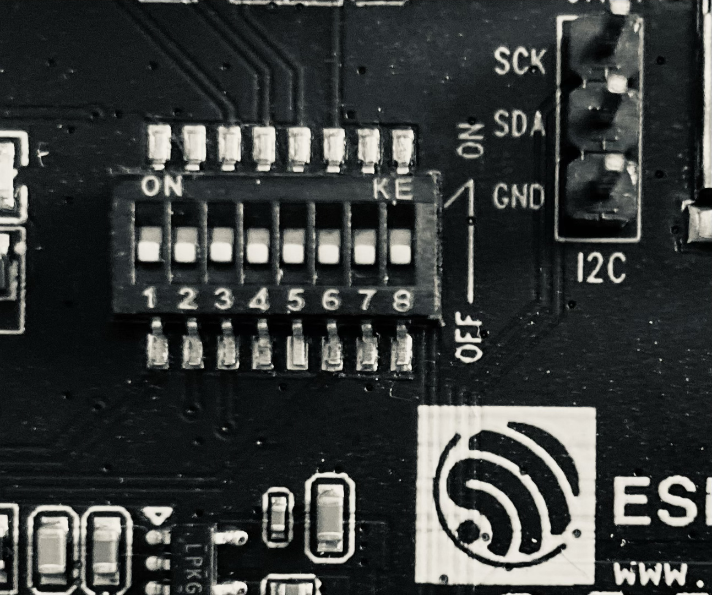


## POLYPHONIC SETUP
The synth can be used as Mono, dual Mono or Quad(4) voice if you have one device.  Please see "MONO/QUAD/POLY (Voice mode)" section for detail.

The number of the voice can be increased if you have more than one device. The voice number can be increased up to 16 (with Quad mode), by stacking up the synths.

_Tested well with two devices, using more than 2 devices is experimental at this stage._

### Audio connection

There are two ways for audio setup:

1. Connect Slave's audio out to Master's Line IN to combine outputs.
2. Connect all audio signals to your mixer.

### MIDI connection

Use TRS cable to connect Master's MIDI out to Slave's MIDI IN.

On the master device, turn on MIDI Forwarding in System menu. All received MIDI signal will be forwarded to the slave device. 

### Preset setup for Polyphonic

Minimum setup to achieve PolyMono (2 Oscillators per voice) will be the following with 2 devices setup:

1. In System menu, "Num of devices" should be 2 for all devices. Set Dev Index=1 for Master device, 2 for Slave device. This will be saved to flash memory.
2. Initialize a preset (SHIFT + PARAM) on Master device.
3. Make sure it plays initial SAW wave sound.
4. Go Key / Other sub-menu and set MonoQuadPolyMode to "PolyMono"
5. SHIFT + MODE PLAY button to dump all preset parameters as MIDI CC messages. After the dump, all preset state should be in sync between devices.
6. Play multiple notes. You should hear four voices.
7. Turn off Compressor of the Slave device (Play:Mixer:Comp threshold to 0.0dB) to match volume

Minimum setup to achieve PolyQuad (one Oscillator per voice) will be the following with 2 devices setup:

1. In System menu, "Num of devices" should be 2 for all devices. Set Dev Index=1 for Master device, 2 for Slave device.
2. Initialize a preset (SHIFT + PARAM) on Master device.
3. Make sure it can play initial SAW wave sound.
4. Go Key / Other sub-menu and set MonoDuoPolyMode to "PolyQuad"
5. SHIFT + MODE PLAY button to dump all preset commands. After the dump, all preset state should be in sync between devices.
6. Play multiple notes. You should hear 8 voices.
7. Turn off Compressor of the Slave device (Play:Mixer:Comp threshold to 0.0dB) to match volume

### Polyphonic tips

Long press in Modo/Quad/Poly param (Long-press button 6 in Key/Other menu) to synchronize parameters between ocillators.

To synchronize all parameters between multiple Qun synthesizers, press SHIFT + MODE PLAY to dump all parameters. It will be sent to slave devices. If you still see issues like out of tune in slave device, try MIDI RECV toggle switch (SHIFT + SYSTEM). It will reset pitch bend or other controller values.


## TIPS/TROUBLESHOOTING

* Unknown MIDI messages sent with device reset?
  * When booting some noise is sent (it's ESP32's boot message) . Please avoid to receive MIDI signals when you reset the device. Use initializing preset (SHIFT +PARAM), instead of hardware reset.
* Trouble with Duo Mode: You need to set up properly to play duo mode properly.
  * Go Key / Other sub-menu and long press button 7. It will sync the parameters OSC1 and OSC2, it will resolve most of issues.
* No sound suddenly
  * Reset the preset. SHIFT + PARAM to initialize the preset.
  * Probably it’s because of last parameter you changed, or some unexpected MIDI cc signal. See the 2nd line of the display, it indicates the parameter received at last.
  * Level overflow may cause the silent, e.g. giving massive delay feedback.
  * Check "Device Index" and "Number of Devices" in system menu. If the Device Index is 2 or more, and you are using it as a primary device, then it may produce no sound. Set the index to 1.
  * Receiving MIDI channel is wrong. Check system setting.
  * Check MIDI Receiving status (Small Square dot in the screen. See PLAY MODE section for detail)
* A noise when you connect multiple devices (chained audio)

  * It is likely because of a ground loop. Use separated power supply. 
* Noise but nothing is connected to the line in.
  * Toggle MIC/LINE select (in System menu), set to Line in.
  * Toggle Line In THRU to off.
  * Initialize a preset.
  * Check Mono/Poly Mode setting. If it’s poly mode, LINE IN pass through turns ON.
* Use different power supply, you get less noise using separated charger.
* Don’t be afraid to get clipped! The synth has 3 great clipping algorithms. Clipping could be the gateway to a whole new sound.
* I want to use AUX as CV IN
  * CV signal from modular synthesizers may have **HIGH VOLTAGE**! Please attenuate the voltage to normal LINE level (1 to 1.5V).

  * AUX is connected to a lot of modules for CV control, so you can use AUX to control tune/width/LFO and others. However, the LINE in has capacitor in the path, it means the signal is AC. Using it as LFO should work, probably down to 2 to 5Hz. But DC signal, e.g. holding the same voltage 5 seconds, might not work.
* MIDI is flooding when I connect MIDI out to DAW.
  * MIDI forwarding is ON.
* Glithes with looper playing
	* One known issue is looper might get gliches when Granular's grain is high with scene loading. It's because of limitation of RAM bandwidth. 

## External Audio processing

You can use LINE IN signal for various purposes. LINE IN is stereo input.

* As CV input to control synth parameters
* As oscillator source. Select "AUXL" or "AUXR" as oscillator source. VCF / effector / Clipping will be applied. If you want to process LINE IN signal as an audio signal, then set Oscillator(1/2)'s signal as "AUXR" or "AUXL", and set the ENV SEL as "ON" (in OSC Switches). Set the gain by changing "VCF Volume" and "AUX In Gain" in Mix sub-menu. 
* Line In Through to Looper. Setting is in System -> Line In Through. It pass through the sound engine, then combined with the output of the sound engine. You can record the input to looper. Compressor will be applied.


## Clock synchronization

The synth can take external clock sources from other synthesizers. When the sync is enabled, sequencer BPM / start / stop is synchronized with external synthesizer or sequencer.
Setting is available in the System menu. Default is OFF. The setting will be saved to internal flash memory.

### MIDI clock
When you set sync mode to "MIDI", the synth will be clock slave mode. Set your DAW to send MIDI clock. We tested Ableton Live, Logic Pro X and KeyStep Pro. It has some latency so please adjust latency setting in your DAW to match the timing.

If you set sync mode to "MOUT" or "MOUT2", then the synth will be clock master. It sends MIDI clock as well as play/stop MIDI messages. Try "MOUT2" if you feel slight delay between devices. MOUT2 will send extra clock signal when start playing because some devices start sequencing from the second clock (Roland MC-101 is the example). If you clock another Qun, use MOUT.

### Sync IN
The synth can take 2PPQ, 4PPQ or 24 PPQ signals. Don't supply high voltage to the synth, it will break. The signal must be supplied to LEFT channel (tip of TRS connector). Using the tip as a sync signal is compatible with Teenage Engineering's Pocket Operator. Supply voltage needs to be more than 500mV. RIGHT channel (AUXR) still can be used as audio signal or CV in.

## SD card folder structure

WAV files can be used by other software. Format is mono, 48kHz, 16 bit.

### LOOPER00
Session data is stored here. It includes Looper recording data. 
Filename | Description
-------- | --------
[T000_1A.wav] | T means track recording, and next 3 digit is Session number, and 1 is Scene number, and A is track number. "0Z" is clipboard data. 
[G000_01.wav] | G is for Granular data. The last 2 digits incidates the bucket index.
[M000_00.dat] | M means mixer data. The first 3 digit means Session number. The second 2 digit is always zero. 
[B000_00_***.dat] | B means Bucket data. This contains 8 preset and 64 sequencer pattern. The first 3 digit means Session number. The second 2 digit is always zero. When session has a name, *** indicates the name of the session. 
[H000_00_0000.wav] | H is for undo history. 

#### File number limit and accessing older Looper folders

When the directory has more than 500 files, then "LOOPER01" will be created to avoid performance issue. Once a new folder created, the new folder is always selected. Only one LOOPERXX folder is accessible. However, you can specify old folder by pressing Button 1 to 8 when booting: Button1 means LOOPER00, Button 2 means LOOPER01, and so on.

### PRESET
Preset is stored here.
Filename | Description
-------- | --------
[G_AAAAAA.WAV] | G means Granular record data. This is saved when Granular mode is not OFF.
[G_AAAAAA.DAT] | G means Granular, it stores analyzed result
[P_AAAAAA.DAT] | P means preset data.
[S_AAAAAA.DAT] | S means sequencer data. One file contains 8 pattern.

### GRANULAR
This is the place to export or import Granular record data. You can put your WAV file here to load the file to Granular engine. Format has to be 48000Hz, 16 bit, Mono.

Filename | Description
-------- | --------
[G_AAAAAA.WAV] | G means Granular record data. This is saved when You perform save command in Granular mode. If you save in Bank1 to Bank8 mode, Granular recording data is stored under Preset folder. 

### SSHOTS
Screnshots is stored here. To take screenshot, press LOOPER STOP + PARAM.

### IMPORT

Import is the folder to import loops to session.
Format has to be mono, 48kHz, 16 bit. See "Session" section for detail.


## Supported MIDI Control numbers

All tone-related parameters can be controlled by MIDI CC signal.

A set of MIDI CC signal can be used as preset save data. Press SHIFT + MODE PLAY button to dump MIDI CC messages.

If you want to control parameters by your MIDI keyboard, use the chart below to check the CC number.
Or, you can see the CC# in the screen at the top of the parameter name.
Assigned CC# can be overridden temporarily.

When you change CC parameters through MIDI keyboard or any other devices, the changed parameter will be shown on the display in real-time, you will see what you are changing, the value and mode names just like when you change parameters directly on the QUN.

Suggested MIDI CC parameters to be assigned if your MIDI keyboard has some knobs:

- MIX: (92) 
- FM: (33)
- Cutoff: (22)
- Resonance: (91)
- LFO Tune: (24)
- VCF Volume: (90)


```
0                            "Save Preset", //0x0
1                            "Mod Wheel", //1
2                            "", //2
3                            "", //3
4                            "", //4
5                            "", //5
6                            "", //6
7                            "Volume", //7
8                            "", //8
9                            "", //9
10                            "", //a
11                            "VCF Volume", //b
12                            "", //c
13                            "", //d
14                            "", //e
15                            "", //f
                            //-----------------------0x10
16                            "", //0x0
17                            "", //1
18                            "", //2
19                            "Slice Spread", //3
20                            "VCF Env Src", //4
21                            "OSC1 Tune(MSB)", //5
22                            "VCF Cutoff(MSB)", //6
23                            "OSC2 Tune(MSB)", //7
24                            "LFO Tune(MSB)", //8
25                            "ENV3/4 Attack", //9
26                            "ENV3/4 Decay", //a
27                            "ENV3/4 Sustain", //b
28                            "ENV3/4 Release", //c
29                            "GRN File Pos", //d
30                            "GRN Length", //e
31                            "GRN Speed", //f
                            //-----------------------0x20
32                            "GRN Grain", //0x0
33                            "FM", //1
34                            "Efct Feedback", //2
35                            "LFO Pulse Width", //3
36                            "OSC1 Pulse Width", //4
37                            "OSC2 Pulse Width", //5
38                            "LFO Pulse Width", //6
39                            "Efct Speed", //7
40                            "VCF Type", //8
41                            "Efct Depth", //9
42                            "OSC1 Bypass", //a
43                            "GRN Detune", //b
44                            "Efct Type", //c
45                            "VCF OSC1 bypass SW", //d
46                            "GRN Detune", //e
47                            "GRN Mode", //f
                            //-----------------------0x30
48                            "LFO Mod Tune", //0x0
49                            "LFO Mod Width", //1
50                            "FM Algorithm", //2
51                            "FM ENV3 Conn", //3
52                            "", //4
53                            "OSC1 Tune(LSB)", //5
54                            "Cutoff(LSB)", //6
55                            "OSC2 Tune(LSB)", //7
56                            "LFO Tune(LSB)", //8
57                            "FM A Amp", // 9
58                            "FM A Freq", //a
59                            "FM B Amp", //b
60                            "FM B Freq", //c
61                            "FM C Amp", //d
62                            "FM C Freq", //e
63                            "FM D Amp", //f
                            //-----------------------0x40
64                            "", //0x0
65                            "OSC2 Mod Sel", //1
66                            "LFO Mod Sel", //2
67                            "ENV1 Inv SW", //3
68                            "OSC1 Env Sel", //4
69                            "OSC2 Env Sel", //5
70                            "ENV2 Inv SW", //6
71                            "LFO Gatesync SW", //7
72                            "FM FREQ SNAP SW", //8
73                            "OSC1 Wide Tune SW", //9
74                            "OSC2 Wide Tune SW", //a
75                            "OSC2 Octave", //b
76                            "OSC1 Octave", //c
77                            "OSC1 Keysync SW", //d
78                            "Velocity SW", //e
79                            "OSC1 LFO Tune", //f
                            //-----------------------0x50
80                            "OSC1 LFO Width", //0x0
81                            "OSC2 LFO Tune", //1
82                            "OSC2 LFO Width", //2
83                            "Mono/Duo/Polly", //3
84                            "VCF LFO Volume", //4
85                            "VCF Mod Cutoff", //5
86                            "LFO Keysplit", //6
87                            "VCF LFO cutoff", //7
88                            "OSC1 Mod Sel", //8
89                            "VCF Mod Sel", //9
90                            "VCF Volume", //a
91                            "VCF Resonance", //b
92                            "OSC Mix", //c
93                            "OSC1 Shape", //d
94                            "OSC2 Shape", //e
95                            "LFO Shape", //f
                            //-----------------------0x60
96                            "ENV1 Attack", //0x0
97                            "AUX In Gain", //1
98                            "", //2 (Won't be dumped)
99                            "", //3 (Won't be dumped)
100                            "Mod Wheel Mode", //4
101                            "", //5 (Won't be dumped)
102                            "ENV1 Decay", //6
103                            "ENV1 Sustain", //7
104                            "ENV1 Release", //8
105                            "ENV2 Attack", //9
106                            "ENV2 Decay", //a
107                            "ENV2 Sustain", //b
108                            "ENV2 Release", //c
109                            "OSC1 Mod Tune", //d
110                            "OSC1 Mod Width", //e
111                            "VCF Pole / NoLinear", //f
                            //-----------------------0x70
112                            "OSC2 Mod Tune", //0x0
113                            "OSC2 Mod Width", //1
114                            "Glide", //2
115                            "Bend Range", //3
116                            "Mod Mode", //4
117                            "VCF Keysync", //5
118                            "Voice Number", //6
119                            "LFO Sync SW", //7
120                            "All Notes Off", //8
121                            "", //9
122                            "", //a
123                            "All Notes Off", //b
124                            "", //c
125                            "", //d
126                            "", //e
127                            "" //f
```

## Sequencer / Looper Control MIDI specification

Some sequencer/looper parameters can be adjusted through Seq Ctl MIDI channel (System mode, button 7).

Note ON messages:

Note | Function
-----|------
C1 to G1 | Select sequener pattern
A1 | Sequencer live rec (Equivalent to REC + SEQ PLAY)
A#1 | Sequencer Play
B1 | Sequencer Stop
C2 to E2 | Select looper scene
A2 | Looper Rec (Equivalent to REC+ LOOPER PLAY)
A#2 | Looper Play
B2 | Looper Stop
C3 to G3 | Select Bucket
C4, C#4, D4, F#4 or G4 | Select looper track for recording (A,B,C, A+B and B+C)

MIDI CC messages
CC# | Function
-----|------
80, 81, 82 | Mute or unmute looper track . 80 is for Track A, 81 is for Track B, 82 is for Track C. If the value is less than 64, the track will be muted. 
83 | Extra Processing. If the value is more than 64, Extra Processing turns on.
84 | Morph

## Quick Setup with Third-party Software & Hardware
The QUN synth can be setup quickly for use with third-party software and hardware by downloading the appropriate configuration file from [Configurations](./configurations). The following configurations files are currently available:

* Native Instruments Maschine
* Native Instruments Komplete Kontrol
